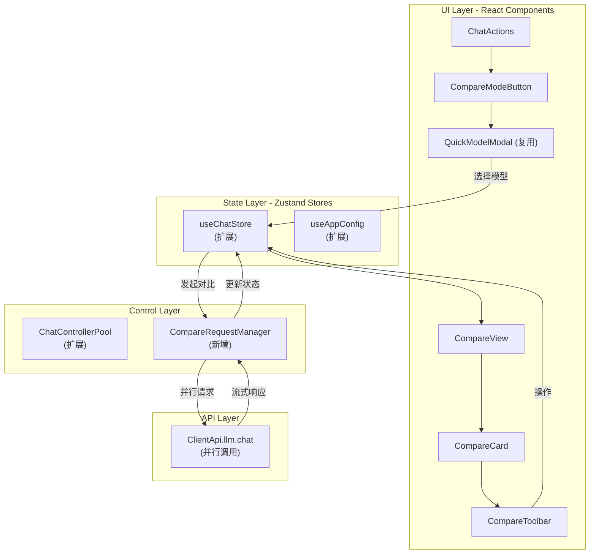
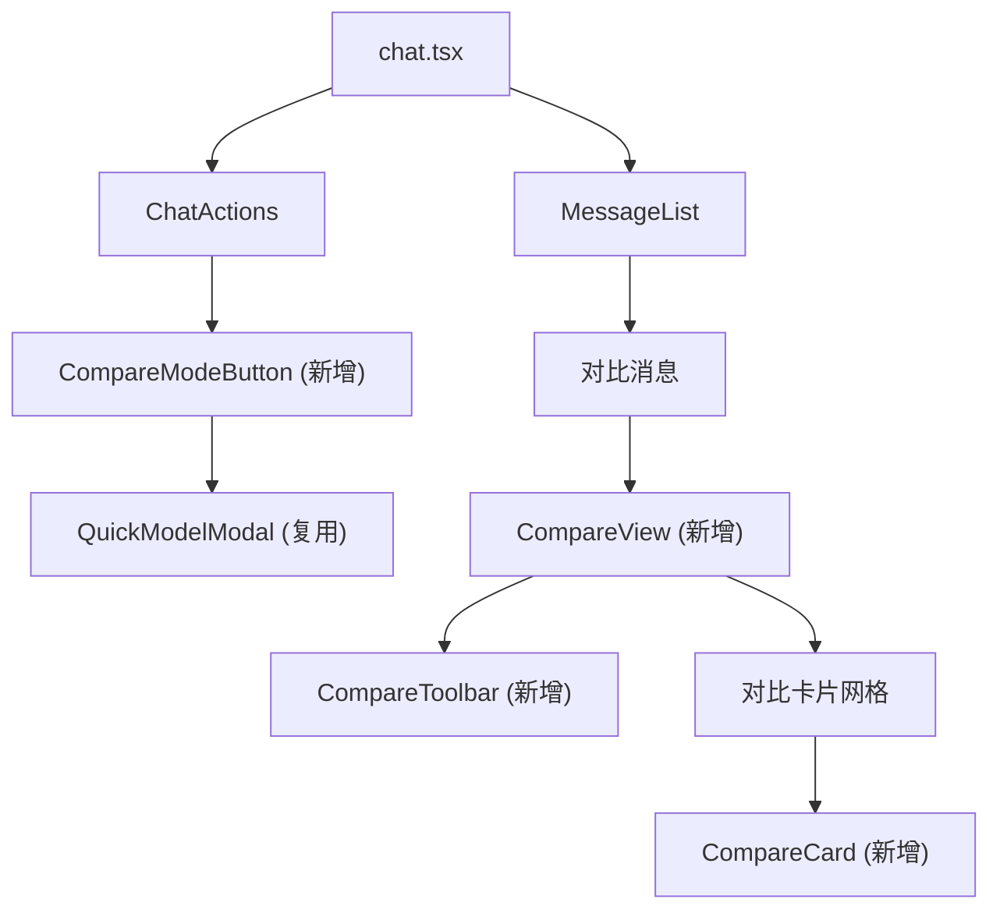
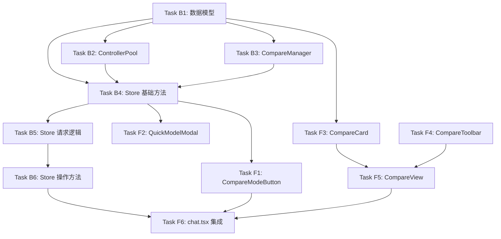

# 多模型对比回复功能 - 技术设计文档

## 文档信息

| 项目 | 内容 |
|------|------|
| 文档版本 | v1.0 |
| 创建日期 | 2026-04-09 |
| 作者 | Architect Agent |
| 状态 | 待评审 |

---

## 1. 整体架构图



---

## 2. 数据模型设计

### 2.1 类型定义扩展

**文件位置**: `app/typing.ts`

```typescript
// 新增：对比模式相关类型
export type CompareStatus = 'pending' | 'streaming' | 'done' | 'error' | 'stopped';

export interface CompareResponse {
  model: string;                    // 使用的模型名称
  providerName: string;             // 服务商
  content: string;                  // 回复内容
  status: CompareStatus;            // 当前状态
  error?: string;                   // 错误信息
  tokens?: number;                  // token 使用量
  latency?: number;                 // 响应延迟（毫秒）
  startTime?: number;               // 请求开始时间
}

export interface CompareMeta {
  enabled: boolean;                 // 是否启用对比模式
  selectedModels: string[];         // 选择的模型列表 ["gpt-4o@OpenAI", ...]
  requestId: string;                // 当前对比请求唯一ID
  layout: 'grid' | 'list';          // 布局模式
}
```

### 2.2 ChatMessage 扩展

**文件位置**: `app/store/chat.ts`

```typescript
// 扩展现有 ChatMessage 类型
export type ChatMessage = RequestMessage & {
  date: string;
  streaming?: boolean;
  isError?: boolean;
  id: string;
  model?: ModelType;
  tools?: ChatMessageTool[];
  audio_url?: string;
  isMcpResponse?: boolean;

  // 新增：对比模式相关字段
  compareMeta?: CompareMeta;        // 元数据（user消息携带）
  compareResponses?: CompareResponse[]; // 各模型回复（assistant消息携带）
};
```

### 2.3 ChatSession 扩展（可选）

对比模式的状态可以存储在消息中，Session 级别无需修改。如需会话级配置：

```typescript
export interface ChatSession {
  // ... 现有字段

  // 可选：会话级对比配置
  compareConfig?: {
    enabled: boolean;
    selectedModels: string[];
    layout: 'grid' | 'list';
  };
}
```

### 2.4 ChatConfig 扩展

**文件位置**: `app/store/config.ts`

```typescript
export const DEFAULT_CONFIG = {
  // ... 现有字段

  // 新增：多模型对比配置
  compareConfig: {
    enabled: true,                  // 是否启用该功能
    maxModels: 6,                   // 最大对比模型数
    defaultLayout: 'grid' as const, // 默认布局
    quickPresets: [                 // 快速预设
      {
        name: "GPT vs Claude",
        models: ["gpt-4o@OpenAI", "claude-3-5-sonnet-latest@Anthropic"],
      },
      {
        name: "国内三杰",
        models: [
          "deepseek-chat@DeepSeek",
          "kimi-latest@Moonshot",
          "glm-4-flash@ChatGLM"
        ],
      },
    ] as const,
  },
};

export type ChatConfig = typeof DEFAULT_CONFIG;
export type CompareConfig = ChatConfig["compareConfig"];
```

---

## 3. 状态管理方案

### 3.1 useChatStore 扩展

**文件位置**: `app/store/chat.ts`

```typescript
// 新增方法
interface ChatStoreMethods {
  // ========== 对比模式核心方法 ==========

  /**
   * 启用对比模式
   * @param selectedModels 选择的模型列表
   */
  enableCompareMode(selectedModels: string[]): void;

  /**
   * 禁用对比模式
   */
  disableCompareMode(): void;

  /**
   * 发起对比请求
   * @param content 用户输入内容
   * @param attachImages 附件图片
   */
  onUserInputWithCompare(
    content: string,
    attachImages?: string[]
  ): Promise<void>;

  /**
   * 更新单个模型的对比回复
   * @param sessionId 会话ID
   * @param requestId 对比请求ID
   * @param modelKey 模型键值 (model@provider)
   * @param updater 更新函数
   */
  updateCompareResponse(
    sessionId: string,
    requestId: string,
    modelKey: string,
    updater: (response: CompareResponse) => void
  ): void;

  /**
   * 采纳某个模型的回复作为正式回复
   * @param modelKey 被采纳的模型键值
   */
  adoptCompareResult(modelKey: string): void;

  /**
   * 停止对比请求（全部或单个）
   * @param modelKey 可选，指定停止某个模型的请求
   */
  stopCompareRequest(modelKey?: string): void;

  /**
   * 重新发起某个模型的请求
   * @param modelKey 模型键值
   */
  retryCompareModel(modelKey: string): void;

  /**
   * 切换布局模式
   * @param layout 布局类型
   */
  setCompareLayout(layout: 'grid' | 'list'): void;
}
```

### 3.2 并发控制策略

使用新增的 `CompareRequestManager` 管理并发请求：

```typescript
// app/client/compare-manager.ts

interface CompareRequestState {
  sessionId: string;
  requestId: string;
  models: string[];
  controllers: Map<string, AbortController>;
  status: Map<string, CompareStatus>;
}

export class CompareRequestManager {
  private states = new Map<string, CompareRequestState>();

  create(sessionId: string, requestId: string, models: string[]): CompareRequestState {
    const state: CompareRequestState = {
      sessionId,
      requestId,
      models,
      controllers: new Map(),
      status: new Map(models.map(m => [m, 'pending'])),
    };
    this.states.set(requestId, state);
    return state;
  }

  setController(requestId: string, modelKey: string, controller: AbortController) {
    const state = this.states.get(requestId);
    if (state) {
      state.controllers.set(modelKey, controller);
    }
  }

  stop(requestId: string, modelKey?: string) {
    const state = this.states.get(requestId);
    if (!state) return;

    if (modelKey) {
      // 停止单个模型
      const controller = state.controllers.get(modelKey);
      controller?.abort();
      state.status.set(modelKey, 'stopped');
    } else {
      // 停止全部
      state.controllers.forEach(c => c.abort());
      state.models.forEach(m => state.status.set(m, 'stopped'));
    }
  }

  remove(requestId: string) {
    this.states.delete(requestId);
  }

  get(requestId: string) {
    return this.states.get(requestId);
  }
}

export const CompareRequestPool = new CompareRequestManager();
```

### 3.3 ChatControllerPool 扩展

**文件位置**: `app/client/controller.ts`

```typescript
export const ChatControllerPool = {
  controllers: {} as Record<string, AbortController>,

  addController(
    sessionId: string,
    messageId: string,
    controller: AbortController,
  ) {
    const key = this.key(sessionId, messageId);
    this.controllers[key] = controller;
    return key;
  },

  // 新增：为对比模式添加控制器
  addCompareController(
    requestId: string,
    modelKey: string,
    controller: AbortController,
  ) {
    const key = `compare:${requestId}:${modelKey}`;
    this.controllers[key] = controller;
    return key;
  },

  stop(sessionId: string, messageId: string) {
    const key = this.key(sessionId, messageId);
    const controller = this.controllers[key];
    controller?.abort();
  },

  // 新增：停止对比模式的单个模型
  stopCompareModel(requestId: string, modelKey: string) {
    const key = `compare:${requestId}:${modelKey}`;
    const controller = this.controllers[key];
    controller?.abort();
  },

  stopAll() {
    Object.values(this.controllers).forEach((v) => v.abort());
  },

  hasPending() {
    return Object.values(this.controllers).length > 0;
  },

  remove(sessionId: string, messageId: string) {
    const key = this.key(sessionId, messageId);
    delete this.controllers[key];
  },

  // 新增：移除对比模式控制器
  removeCompare(requestId: string, modelKey: string) {
    const key = `compare:${requestId}:${modelKey}`;
    delete this.controllers[key];
  },

  key(sessionId: string, messageIndex: string) {
    return `${sessionId},${messageIndex}`;
  },
};
```

---

## 4. 组件架构

### 4.1 新增组件清单

| 组件名称 | 文件路径 | 职责 |
|---------|---------|------|
| `CompareModeButton` | `app/components/compare/CompareModeButton.tsx` | 对比模式入口按钮 |
| `CompareView` | `app/components/compare/CompareView.tsx` | 对比结果主容器 |
| `CompareCard` | `app/components/compare/CompareCard.tsx` | 单模型回复卡片 |
| `CompareToolbar` | `app/components/compare/CompareToolbar.tsx` | 对比工具栏 |
| `CompareEmptyState` | `app/components/compare/CompareEmptyState.tsx` | 空状态提示 |

### 4.2 需要修改的现有组件

| 组件 | 修改内容 |
|------|---------|
| `ChatActions` | 添加对比模式按钮 |
| `chat.tsx` | 集成对比模式，处理消息渲染 |
| `Selector` (ui-lib) | 复用作为模型选择器（支持多选） |

### 4.3 组件层级关系



### 4.4 关键组件接口

#### CompareModeButton

```typescript
interface CompareModeButtonProps {
  isEnabled: boolean;              // 是否已启用对比模式
  selectedModels: string[];        // 已选择的模型
  onToggle: () => void;            // 切换对比模式
  onModelSelect: (models: string[]) => void; // 模型选择回调
}
```

#### CompareView

```typescript
interface CompareViewProps {
  compareMeta: CompareMeta;        // 元数据
  compareResponses: CompareResponse[]; // 各模型回复
  layout: 'grid' | 'list';         // 布局模式
  onUpdate: (modelKey: string, updater: (r: CompareResponse) => void) => void;
  onAdopt: (modelKey: string) => void;
  onStop: (modelKey?: string) => void;
  onRetry: (modelKey: string) => void;
  onLayoutChange: (layout: 'grid' | 'list') => void;
}
```

#### CompareCard

```typescript
interface CompareCardProps {
  model: string;
  providerName: string;
  response: CompareResponse;
  onCopy: () => void;
  onAdopt: () => void;
  onStop: () => void;
  onRetry: () => void;
}
```

---

## 5. API 调用层改造

### 5.1 并行请求实现

**关键原则**：复用现有 `api.llm.chat()`，通过 Promise.all 并行发起。

```typescript
// app/store/chat.ts 中的实现示例

async onUserInputWithCompare(
  content: string,
  attachImages?: string[]
): Promise<void> {
  const session = get().currentSession();
  const config = useAppConfig.getState();
  const compareConfig = session.compareConfig || config.compareConfig;

  if (!compareConfig.selectedModels || compareConfig.selectedModels.length < 2) {
    showToast("至少选择 2 个模型进行对比");
    return;
  }

  const requestId = nanoid();
  const selectedModels = compareConfig.selectedModels;
  const modelConfig = session.mask.modelConfig;

  // 创建用户消息（携带元数据）
  const userMessage: ChatMessage = createMessage({
    role: "user",
    content: attachImages && attachImages.length > 0
      ? [
          ...(content ? [{ type: "text" as const, text: content }] : []),
          ...attachImages.map(url => ({ type: "image_url" as const, image_url: { url } })),
        ]
      : content,
    compareMeta: {
      enabled: true,
      selectedModels: selectedModels,
      requestId,
      layout: compareConfig.defaultLayout,
    },
  });

  // 创建助手消息（携带各模型回复容器）
  const botMessage: ChatMessage = createMessage({
    role: "assistant",
    streaming: true,
    compareResponses: selectedModels.map(modelKey => {
      const [model, providerName] = getModelProvider(modelKey);
      return {
        model,
        providerName: providerName || "OpenAI",
        content: "",
        status: 'pending',
        startTime: Date.now(),
      };
    }),
  });

  // 获取历史消息
  const recentMessages = await get().getMessagesWithMemory();
  const sendMessages = recentMessages.concat(userMessage);

  // 保存消息
  get().updateTargetSession(session, (session) => {
    session.messages = session.messages.concat([userMessage, botMessage]);
  });

  // 并行发起请求
  const requests = selectedModels.map(async (modelKey) => {
    const [model, providerName] = getModelProvider(modelKey);

    // 更新状态为 streaming
    get().updateCompareResponse(session.id, requestId, modelKey, (r) => {
      r.status = 'streaming';
    });

    const api: ClientApi = getClientApi(providerName as ServiceProvider);

    return api.llm.chat({
      messages: sendMessages,
      config: {
        ...modelConfig,
        model,
        providerName,
        stream: true,
      },
      onUpdate: (message, chunk) => {
        get().updateCompareResponse(session.id, requestId, modelKey, (r) => {
          r.content = message;
        });
      },
      onFinish: (message) => {
        get().updateCompareResponse(session.id, requestId, modelKey, (r) => {
          r.status = 'done';
          r.content = message;
          r.latency = Date.now() - (r.startTime || Date.now());
        });
        ChatControllerPool.removeCompare(requestId, modelKey);
      },
      onError: (error) => {
        get().updateCompareResponse(session.id, requestId, modelKey, (r) => {
          r.status = 'error';
          r.error = error.message;
        });
        ChatControllerPool.removeCompare(requestId, modelKey);
      },
      onController: (controller) => {
        ChatControllerPool.addCompareController(requestId, modelKey, controller);
      },
    });
  });

  // 等待所有请求完成（不阻塞UI，各请求独立更新）
  Promise.allSettled(requests).finally(() => {
    get().updateTargetSession(session, (session) => {
      const msg = session.messages.find(m => m.id === botMessage.id);
      if (msg) msg.streaming = false;
    });
  });
}
```

### 5.2 错误隔离机制

每个模型的请求独立处理，互不影响：

1. **独立 catch**：每个 Promise 有独立的 onError 处理
2. **状态隔离**：每个模型的 status 独立维护
3. **UI 隔离**：CompareCard 根据 status 独立渲染

---

## 6. 详细任务分解

### 6.1 Backend Dev 任务（Store + 逻辑层）

#### Task B1: 数据模型扩展
**复杂度**: 低
**文件**:
- `app/typing.ts` - 新增类型定义
- `app/store/config.ts` - 扩展 DEFAULT_CONFIG

**依赖**: 无

**实现内容**:
```typescript
// app/typing.ts 新增
export type CompareStatus = 'pending' | 'streaming' | 'done' | 'error' | 'stopped';

export interface CompareResponse {
  model: string;
  providerName: string;
  content: string;
  status: CompareStatus;
  error?: string;
  tokens?: number;
  latency?: number;
  startTime?: number;
}

export interface CompareMeta {
  enabled: boolean;
  selectedModels: string[];
  requestId: string;
  layout: 'grid' | 'list';
}
```

#### Task B2: ChatControllerPool 扩展
**复杂度**: 低
**文件**: `app/client/controller.ts`

**依赖**: Task B1

**实现内容**:
```typescript
// 新增方法
addCompareController(requestId: string, modelKey: string, controller: AbortController)
stopCompareModel(requestId: string, modelKey: string)
removeCompare(requestId: string, modelKey: string)
```

#### Task B3: CompareRequestManager 实现
**复杂度**: 中
**文件**: `app/client/compare-manager.ts` (新建)

**依赖**: Task B1

**接口签名**:
```typescript
class CompareRequestManager {
  create(sessionId: string, requestId: string, models: string[]): CompareRequestState
  setController(requestId: string, modelKey: string, controller: AbortController): void
  stop(requestId: string, modelKey?: string): void
  remove(requestId: string): void
  get(requestId: string): CompareRequestState | undefined
}
```

#### Task B4: useChatStore 扩展 - 基础方法
**复杂度**: 中
**文件**: `app/store/chat.ts`

**依赖**: Task B1, B2, B3

**实现方法**:
```typescript
enableCompareMode(selectedModels: string[]): void
disableCompareMode(): void
updateCompareResponse(sessionId, requestId, modelKey, updater): void
setCompareLayout(layout: 'grid' | 'list'): void
```

#### Task B5: useChatStore 扩展 - 核心请求逻辑
**复杂度**: 高
**文件**: `app/store/chat.ts`

**依赖**: Task B4

**实现方法**:
```typescript
async onUserInputWithCompare(content: string, attachImages?: string[]): Promise<void>
```

#### Task B6: useChatStore 扩展 - 操作方法
**复杂度**: 中
**文件**: `app/store/chat.ts`

**依赖**: Task B5

**实现方法**:
```typescript
adoptCompareResult(modelKey: string): void
stopCompareRequest(modelKey?: string): void
retryCompareModel(modelKey: string): void
```

---

### 6.2 Frontend Dev 任务（UI 组件）

#### Task F1: CompareModeButton 组件
**复杂度**: 低
**文件**: `app/components/compare/CompareModeButton.tsx`

**依赖**: Task B1, Task B4

**Props 接口**:
```typescript
interface Props {
  isEnabled: boolean;
  selectedModels: string[];
  onToggle: () => void;
  onModelSelect: (models: string[]) => void;
}
```

#### Task F2: QuickModelModal 多选支持
**复杂度**: 低
**文件**: `app/components/quick-model-modal.tsx`

**依赖**: Task B1

**修改内容**: 支持多选模式，添加全选/取消全选按钮，限制 2-6 个选择

#### Task F3: CompareCard 组件
**复杂度**: 中
**文件**: `app/components/compare/CompareCard.tsx`

**依赖**: Task B1

**Props 接口**:
```typescript
interface Props {
  model: string;
  providerName: string;
  response: CompareResponse;
  onCopy: () => void;
  onAdopt: () => void;
  onStop: () => void;
  onRetry: () => void;
  layout?: 'grid' | 'list';
}
```

#### Task F4: CompareToolbar 组件
**复杂度**: 低
**文件**: `app/components/compare/CompareToolbar.tsx`

**依赖**: 无

**Props 接口**:
```typescript
interface Props {
  layout: 'grid' | 'list';
  onLayoutChange: (layout: 'grid' | 'list') => void;
  onStopAll: () => void;
  onCollapseAll: () => void;
  onExpandAll: () => void;
}
```

#### Task F5: CompareView 主容器组件
**复杂度**: 中
**文件**: `app/components/compare/CompareView.tsx`

**依赖**: Task F3, F4

**Props 接口**:
```typescript
interface Props {
  compareMeta: CompareMeta;
  compareResponses: CompareResponse[];
  layout: 'grid' | 'list';
  onUpdate: (modelKey: string, updater: (r: CompareResponse) => void) => void;
  onAdopt: (modelKey: string) => void;
  onStop: (modelKey?: string) => void;
  onRetry: (modelKey: string) => void;
  onLayoutChange: (layout: 'grid' | 'list') => void;
}
```

#### Task F6: chat.tsx 集成
**复杂度**: 高
**文件**: `app/components/chat.tsx`

**依赖**: Task F1, F5, Task B6

**修改内容**:
1. 在 ChatActions 中集成 CompareModeButton
2. 在消息渲染中检测 compareMeta，渲染 CompareView
3. 处理采纳操作后的状态更新

---

## 7. 风险评估

### 7.1 技术风险

| 风险 | 影响 | 缓解措施 |
|------|------|---------|
| 并发请求导致浏览器连接数限制 | 中 | 使用浏览器默认并发限制（6个），符合需求 |
| 流式响应更新频率过高导致性能问题 | 中 | 使用节流控制 UI 更新频率 |
| 消息数据结构变化导致历史数据不兼容 | 低 | 添加数据迁移逻辑，旧消息正常显示 |
| 内存占用过大（长对话 + 多模型） | 中 | 实现虚拟滚动，限制渲染数量 |

### 7.2 性能风险

| 指标 | 风险 | 缓解措施 |
|------|------|---------|
| 并发请求数 | 最多 6 个同时进行 | 符合浏览器限制 |
| Token 消耗 | 一次消耗多倍 | UI 显示提示，用户自主选择 |
| 渲染性能 | 6 个 Markdown 同时渲染 | 使用虚拟滚动 + 懒加载 |

---

## 8. 关键代码示例

### 8.1 ChatMessage 扩展

```typescript
export type ChatMessage = RequestMessage & {
  date: string;
  streaming?: boolean;
  isError?: boolean;
  id: string;
  model?: ModelType;
  tools?: ChatMessageTool[];
  audio_url?: string;
  isMcpResponse?: boolean;

  // 对比模式字段
  compareMeta?: CompareMeta;
  compareResponses?: CompareResponse[];
};
```

### 8.2 onUserInput 修改（兼容对比模式）

```typescript
async onUserInput(content: string, attachImages?: string[]) {
  const session = get().currentSession();
  const compareConfig = session.compareConfig;

  // 检查是否启用对比模式
  if (compareConfig?.enabled && compareConfig.selectedModels.length >= 2) {
    return get().onUserInputWithCompare(content, attachImages);
  }

  // 原有逻辑...
}
```

### 8.3 采纳操作实现

```typescript
adoptCompareResult(modelKey: string): void {
  const session = get().currentSession();
  const messages = session.messages;

  // 找到最近的对比消息对
  let lastIndex = messages.length - 1;
  while (lastIndex >= 0 && !messages[lastIndex].compareResponses) {
    lastIndex--;
  }

  if (lastIndex < 0) return;

  const botMessage = messages[lastIndex];
  const userMessage = messages[lastIndex - 1];

  if (!botMessage.compareResponses) return;

  const selectedResponse = botMessage.compareResponses.find(r => `${r.model}@${r.providerName}` === modelKey);
  if (!selectedResponse) return;

  // 创建新的消息对（采纳后的正式回复）
  const newUserMessage = createMessage({
    ...userMessage,
    id: nanoid(),
    compareMeta: undefined,
  });

  const newBotMessage = createMessage({
    role: 'assistant',
    content: selectedResponse.content,
    model: selectedResponse.model as ModelType,
    streaming: false,
  });

  // 替换原消息
  get().updateTargetSession(session, (session) => {
    session.messages[lastIndex - 1] = newUserMessage;
    session.messages[lastIndex] = newBotMessage;
  });

  // 关闭对比模式
  get().disableCompareMode();
}
```

---

## 9. 数据迁移策略

由于添加了可选字段，不需要强制迁移：

1. **旧消息**：`compareMeta` 为 undefined，正常渲染为普通消息
2. **新消息**：启用对比模式时才填充 `compareMeta`
3. **Store 版本**：保持在 3.3，向后兼容

---

## 10. 国际化支持

**文件**: `app/locales/cn.ts` (其他语言类似)

```typescript
export default {
  Compare: {
    Title: "多模型对比",
    Button: "对比模式",
    Description: "选择多个模型同时回答",
    SelectModels: "选择对比模型",
    MinModels: "至少选择 2 个模型",
    MaxModels: "最多选择 6 个模型",
    SelectCount: "已选择 {{count}} 个模型",
    Presets: {
      Title: "快速预设",
      GptVsClaude: "GPT vs Claude",
      Domestic: "国内三杰",
      Custom: "自定义",
    },
    Status: {
      Pending: "等待中",
      Streaming: "生成中",
      Done: "已完成",
      Error: "失败",
      Stopped: "已停止",
    },
    Actions: {
      Adopt: "采纳",
      Copy: "复制",
      Retry: "重试",
      Stop: "停止",
      StopAll: "全部停止",
      ExpandAll: "全部展开",
      CollapseAll: "全部折叠",
    },
    Layout: {
      Grid: "网格视图",
      List: "列表视图",
    },
    Empty: "请选择至少 2 个模型开始对比",
    AdoptedToast: "已采纳 {{model}} 的回复",
  },
  // ...
};
```

---

## 11. 验收标准

### 功能验收

| # | 验收项 | 通过条件 |
|---|--------|----------|
| 1 | 对比模式入口 | 点击按钮能弹出模型选择器 |
| 2 | 模型选择限制 | 少于 2 个禁用发送，超过 6 个提示 |
| 3 | 并行请求 | 发送后所有模型同时开始响应 |
| 4 | 流式渲染 | 各模型回复独立流式显示 |
| 5 | 网格布局 | 2 列网格正确展示 |
| 6 | 列表视图 | 折叠/展开切换正常 |
| 7 | 采纳功能 | 点击采纳后消息合并到历史 |
| 8 | 复制功能 | 各回复可独立复制 |
| 9 | 停止功能 | 可停止全部/单个模型 |
| 10 | 错误处理 | 部分失败不影响其他模型 |
| 11 | 重新发送 | 失败模型可单独重试 |
| 12 | 上下文保持 | 采纳后继续对话，上下文正确 |

### 性能验收

| # | 指标 | 要求 |
|---|------|------|
| 1 | 首屏渲染 | < 300ms |
| 2 | 流式延迟 | < 100ms |
| 3 | 并发处理 | 6 个模型无卡顿 |

---

## 12. 附录

### 12.1 任务依赖关系图



### 12.2 关键决策记录

| 决策 | 选择 | 理由 |
|------|------|------|
| 数据存储位置 | 消息级别 | 避免会话级状态复杂度，支持历史对比查看 |
| 并发控制 | ChatControllerPool 扩展 | 复用现有机制，保持一致性 |
| UI 复用 | QuickModelModal 改造 | 减少代码重复，已有 Provider 分组 |
| 状态同步 | 直接更新 Store | Zustand 响应式，无需额外状态管理 |

---

**文档状态**: 完成 ✍️
**下一步**: 提交评审，确认后开始开发
